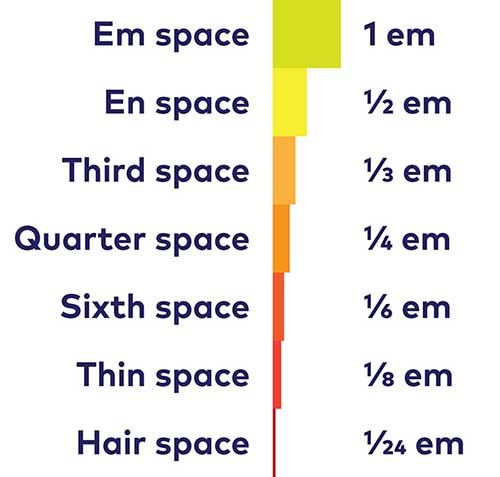
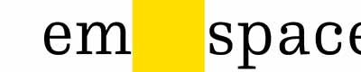

# 空格、空格和空格

> :fontawesome-regular-face-grin: 盛勃
>
> :material-clock-edit-outline: 2023年6月26日 0:42:32

**空格（space）**，Basic Latin U+0020 ——一般按键盘打出的 ASCII 字符

**全宽空格（em space）系列**，General Punctuation U+2000 – U+200A ——“em”即 m，em 空格的宽度与 m 相同，半宽空格的“en”同理。由此可衍生出各种宽度的空格。这些空格可与标点符号合用。例如“the final frontier—space”中，破折号前后过紧，可插入 hair space 填充。

<figure markdown='span'>
    
    <figcaption markdown='1'>很多空格的宽度与全宽空格绑定 | [FontShop](https://www.fontshop.com/content/adventures-in-space_spaces)</figcaption>
</figure>

<figure markdown='span'>
    
    <figcaption markdown='1'>全宽空格 | [FontShop](https://www.fontshop.com/content/adventures-in-space_spaces)</figcaption>
</figure>

**不间断空格（no-break space）**，Latin-1 Supplement U+00A0 ——你可能见过`&nbsp;`，就是它。HTML 为了允许缩进，连续空格作单一空格解读。那么怎样空出一大段“              ”呢？用一系列`&nbsp;`替代即可。

**零宽空格（zero width space）**，General Punctuation U+200B ——这是格式字符，可用于指示单词边界。例如“Dear Sir​/​Madam”的斜线前后就可加这种空格，这可能影响文本在何处换行。另外，零宽空格听起来就自相矛盾，没有广泛支持，输入它能搞坏不少终端的显示系统。（不要妄图用零宽空格写不缩进的 python 代码）

```python
>>> if True:
>>> ​assert False
SyntaxError: invalid non-printable character U+200B
```

**象形文字空格（ideographic space）**，CJK Symbols and Punctuation U+3000 ——宽度与中日韩象形文字相等，一般输入法打出的全宽空格就是它。

Python 标准库 **unicodedata** 包含了这些数据。

```python
>>> from unicodedata import name, lookup
>>> lookup("em space")
'\u2003'
>>> print(f"→{_}←")
→ ←
>>> name("")
'IDEOGRAPHIC SPACE'
```

:material-eye-arrow-right-outline: [Adventures in Space: Spaces | FontShop](https://www.fontshop.com/content/adventures-in-space_spaces)

:material-eye-arrow-right-outline: [Table 6-2. Unicode Space Characters – §6.2 General Punctuation | Unicode 17.0.0 Core Specification](https://www.unicode.org/versions/Unicode17.0.0/core-spec/chapter-6/#G17548)

:material-eye-arrow-right-outline: [Zero-Width Space | CSS-Tricks - CSS-Tricks](https://css-tricks.com/zero-width-space/)
