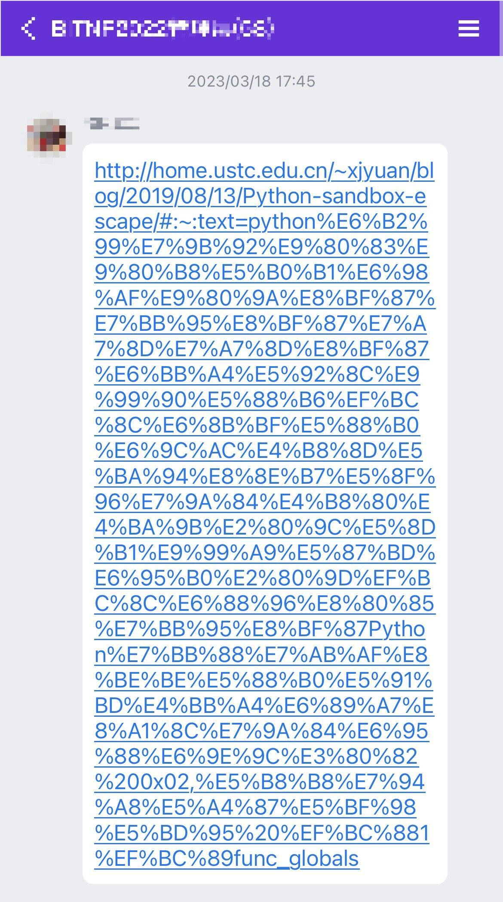

# Unicode 链接化草案

> :fontawesome-regular-face-grin: Y.D.X.
>
> :material-clock-edit-outline: 2024年11月27日 10:29:42

前不久Unicode针对“链接化”问题发布了58号草案，正在征求反馈。

:material-eye-arrow-right-outline:
[Proposed Draft UTS #58: Unicode Linkification][tr58]

你在聊天框里发出纯文本，软件会自动识别出其中的URL，把它做成单击就能访问的链接，即链接化（linkification）。

然而对于汉字等非ASCII字符，这么实用的功能却常常失效。

<figure markdown='span'>
  {width=50%}
  <figcaption>URL夹在括号内，但右括号被误当成URL的一部分，于是好好的网页变成了404</figcaption>
</figure>

URL除了错误延长，还会提前终止。

<figure markdown='span'>
  {width=50%}
  <figcaption>URL本来有文字锚点，但第一个字就被裁去了，锚点完全丢失</figcaption>
</figure>

传统上用编码解决非ASCII字符问题，但那样会变成一大段天书，效果很差。

<figure markdown='span'>
  {width=30%}
  <figcaption markdown='1'>编码会制造天书</figcaption>
</figure>

新的[58号草案][tr58]有望促进解决这类问题。它计划规定一种从纯文本检测URL的标准方法，为每一字符记录相关属性，并提供算法流程。

比如针对上文提到的括号问题，当前草案规定：与URL内`（`匹配的`）`应视作URL的一部分，而不匹配的`）`应终止解析。`）`字符的这一性质会记录到`Link_Termination`、`Link_Paired_Opener`等字段。

[tr58]: https://www.unicode.org/reports/tr58/

:material-eye-arrow-right-outline:
[The Unicode Blog: Feedback Requested on Proposed Draft UTS #58 Unicode Linkification](https://blog.unicode.org/2024/11/feedback-requested-on-proposed-draft.html)

<figure markdown>
  
  <figcaption markdown>[xkcd: Unicode](https://xkcd.com/1726/)</figcaption>
</figure>
